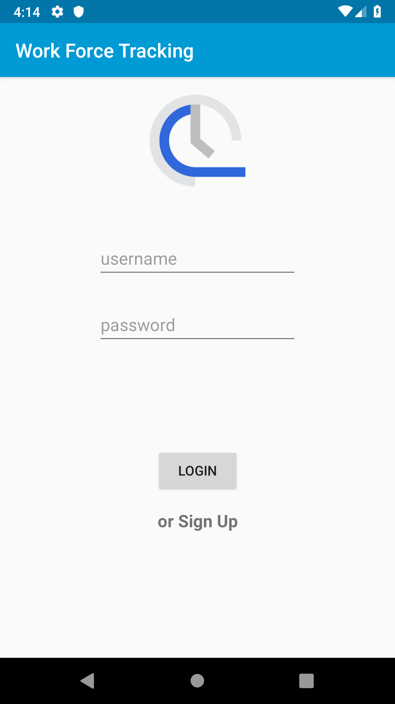
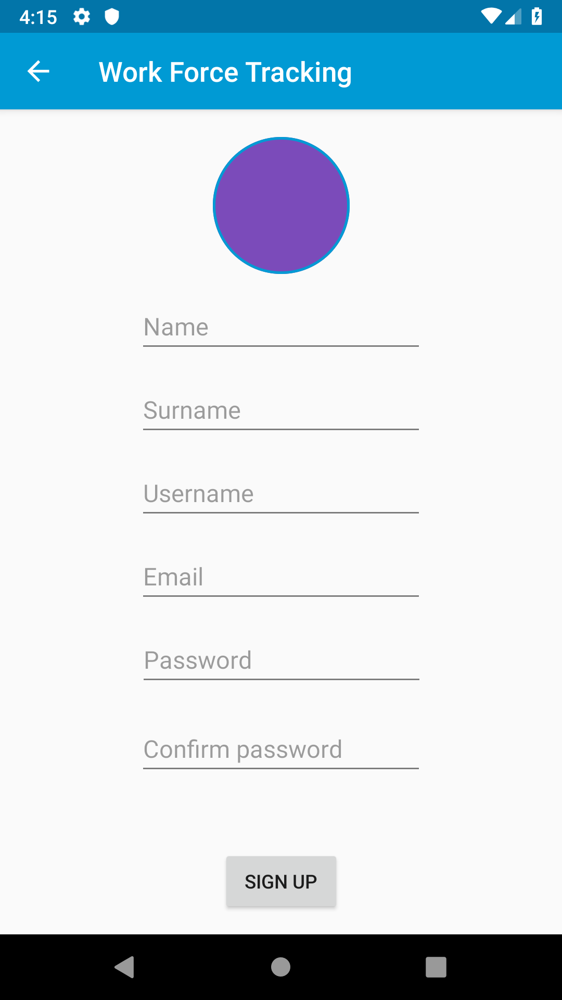
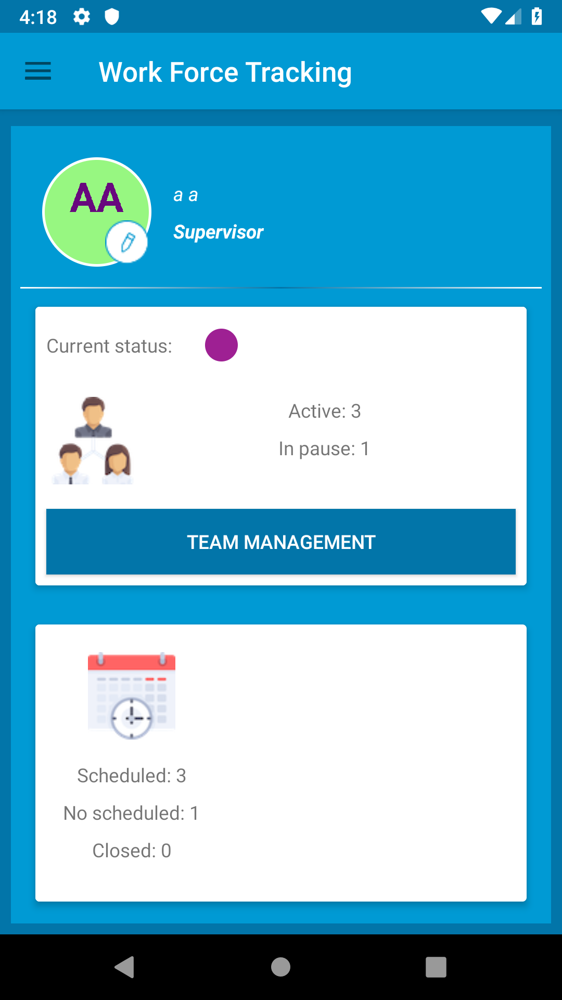
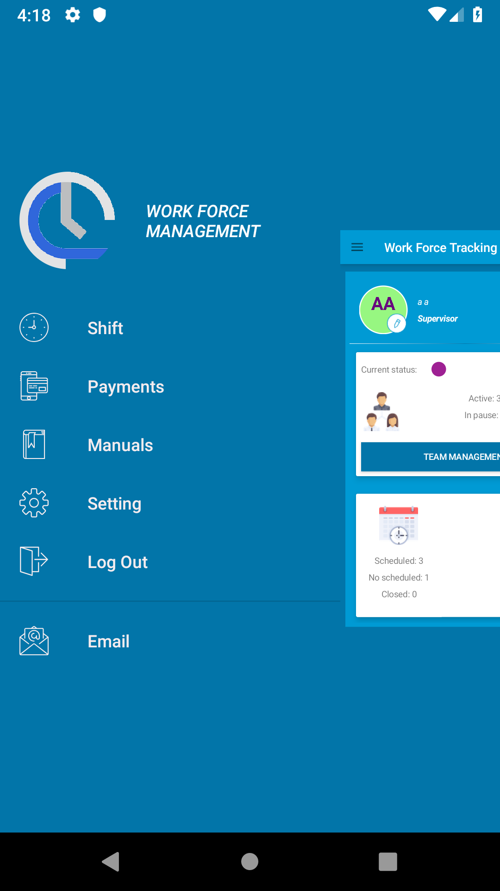

# WorkForceTracking (UNDER DEVELOPMENT)
This project is a simple worke force management app. It takes for granted that we have a web service for all the informations
about team, jobs and so on. There's a login/signup page and a dashboard with a lot of functionalities.
I've used a MVVM architecture with Room, Entity, Dao, Repository and Viewmodel. I've also prepared for Dagger2 and Retrofit,
not yet implemented.

